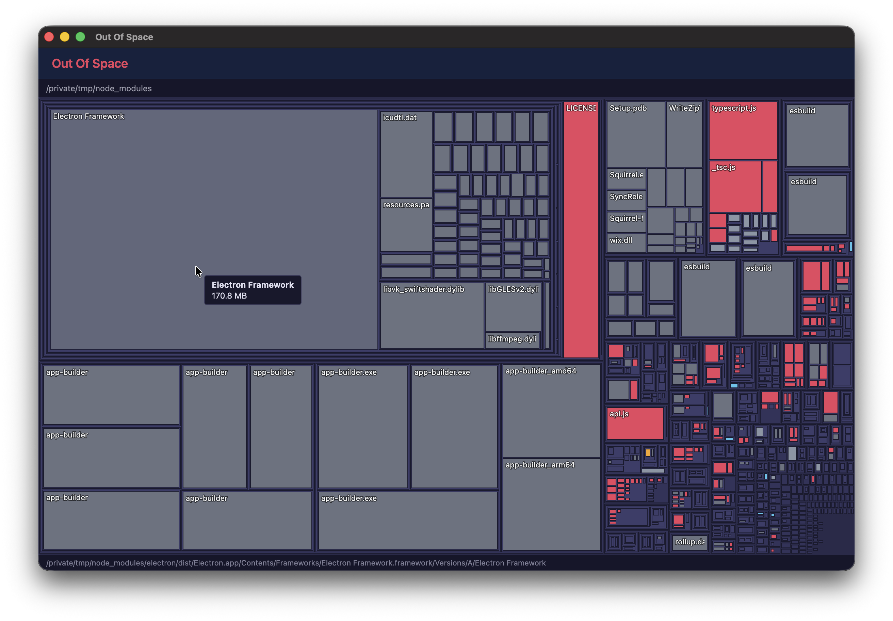

# Out Of Space

[](LICENSE)

**Visualise what's eating your disk space.** An interactive treemap explorer for local filesystem directories.

Built with Electron, Vue 3, and D3.



## Status

Work in progress — directory scanning, interactive treemap visualisation, and context actions are functional. Packaging remains.

## Getting Started

### Prerequisites

- Node.js (v18+)
- npm

### Development

```bash
# Install dependencies
npm install

# Start dev server with hot reload
npm run dev

# Type check
npm run typecheck

# Production build
npm run build
```

## Project Structure

```
src/
  main/              # Electron main process (app lifecycle, window management)
  preload/           # Preload scripts (IPC bridge between main and renderer)
  shared/            # Types and constants shared between main and renderer
  renderer/          # Vue 3 app (UI, visualisation)
    src/
      components/    # Reusable Vue components
      composables/   # Vue composables
      stores/        # Pinia stores
      views/         # Top-level views
      visualisation/ # D3 visualisation layer (treemap, sunburst)
```

## Features

- Scan any local folder and visualise disk usage as an interactive treemap
- Colour-coded rectangles by file type (code, images, documents, archives, etc.)
- Drill down into subdirectories, navigate with Select Parent / Drill Into / Up
- Hover tooltips with file name and human-readable size
- Status bar showing full path of hovered item
- Switchable visualisation modes (treemap implemented, sunburst planned)
- "Reveal in File Manager" and "Open in Terminal" context actions
- Validated on macOS and Windows 11

## License

[MIT](LICENSE) — Copyright 2026 Florian Scholz
